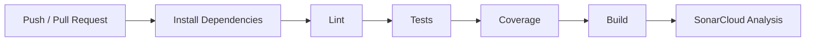

# CI/CD Report - aymer-proy-umb

## 1. Descripción General

Este proyecto implementa una API REST desarrollada con Node.js, Express y TypeScript.

Se configuró un pipeline de Integración Continua (CI) utilizando GitHub Actions para automatizar:

- Instalación de dependencias
- Verificación de calidad de código
- Ejecución de pruebas
- Generación de cobertura
- Compilación del proyecto
- Análisis estático con SonarCloud

---

## 2. Diagrama del Pipeline



---

## 3. Workflow Implementado

### Install

Instala todas las dependencias mediante:

```bash
npm ci
```

---

### Lint

Verifica el cumplimiento de estándares de codificación mediante ESLint.

```bash
npm run lint
```

---

### Test

Ejecuta pruebas unitarias e integración usando Jest.

```bash
npm test
```

---

### Coverage

Genera reporte de cobertura utilizando Istanbul (integrado en Jest).

```bash
npm test -- --coverage
```

---

### Build

Compila TypeScript a JavaScript.

```bash
npm run build
```

---

### SonarCloud

Realiza análisis estático de calidad del código.

Métricas evaluadas:

- Bugs
- Vulnerabilidades
- Code Smells
- Cobertura
- Duplicación

---

## 4. Métricas de Calidad

### Cobertura de Código

| Métrica | Resultado |
|----------|------------|
| Statements | 94.44% |
| Branches | 66.66% |
| Functions | 100% |
| Lines | 93.33% |

---

### Complejidad Ciclomática

La aplicación presenta una complejidad baja debido a:

- Endpoints simples
- Lógica de negocio reducida
- Ausencia de estructuras anidadas complejas

Complejidad estimada:

| Módulo | Complejidad |
|----------|------------|
| app.ts | Baja |
| usuario.services.ts | Baja |

El análisis detallado se encuentra disponible en SonarCloud.

---

### Issues de Lint

Resultado actual:

| Tipo | Cantidad |
|--------|---------|
| Errors | 0 |
| Warnings | 0 |

El proyecto cumple con las reglas configuradas de ESLint.

---

## 5. Pruebas Implementadas

### Pruebas de Integración

Se implementaron pruebas para:

1. POST /usuarios
2. GET /usuarios
3. DELETE /usuarios/:id

---

### Pruebas Unitarias

Se implementaron pruebas para:

1. Crear usuario
2. Asignar ID
3. Listar usuarios
4. Eliminar usuario existente
5. Eliminar usuario inexistente
6. Validar nombre creado
7. Incrementar cantidad de usuarios

Total:

- 10 pruebas ejecutadas
- 10 pruebas exitosas

---

## 6. Justificación de Thresholds

Se definió un umbral mínimo de cobertura del 80% para:

- Statements
- Branches

### Razones

- Garantizar que la mayor parte de la lógica esté validada.
- Reducir riesgos de regresiones.
- Mantener calidad del código durante futuras modificaciones.
- Cumplir con buenas prácticas de integración continua.

El valor del 80% es ampliamente utilizado en entornos académicos e industriales como un nivel adecuado de confianza sin imponer costos excesivos de mantenimiento.

---

## 7. Herramientas Utilizadas

| Herramienta | Propósito |
|------------|-----------|
| GitHub Actions | Pipeline CI |
| TypeScript | Desarrollo |
| Express | API REST |
| Jest | Testing |
| Istanbul | Cobertura |
| ESLint | Calidad de código |
| SonarCloud | Análisis estático |
| GitHub | Control de versiones |

---

## 8. Conclusiones

Se implementó exitosamente un pipeline CI/CD que automatiza la validación de calidad del proyecto.

Los resultados muestran:

- Compilación automatizada
- Pruebas automatizadas
- Cobertura superior al 80% en statements
- Análisis estático continuo
- Integración con SonarCloud

Esto permite detectar errores tempranamente y mantener estándares de calidad durante el ciclo de desarrollo.